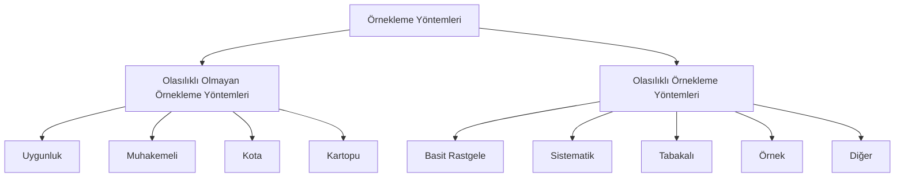

Anket konusuyla bağlantılı olarak yaygın şekilde kullanılan başlıca terim ve kavramlar şöyledir.

**Anket:**
Bilgi toplama amacıyla yapılan incelemeler ve sorgulamalar.

**Anketör:**
Görüşmeyi veya iletişimi sağlayarak anketi uygulayan kişi.

**Katılımcı veya Denek:**
Görüşmeye katılan veya anketi yanıtlayan kişi.

**Küme veya Evren:**
İnceleme konusu olan ve deneklerin oluşturduğu topluluk.

**Küme Büyüklüğü (Kitle):**
Araştırılan kümedeki toplam denek sayısı.

**Sonsuz Küme:**
Çok sayıda birim içeren veya toplam birim sayısı bilinmeyecek kadar fazla olan küme.

**Sonlu Küme:**
Sınırlı sayıda birim içeren küçük küme.

**Tam Sayı:**
Kümenin tüm birimlerinden bilgi almayı amaçlayan inceleme.

**Örnek:**
Kümeden belirli bir yöntemle seçilen kısım veya bölüm.

**Örneklem Hacmi:**
Alınan örnekteki birim sayısı ya da örnek büyüklüğü.

**Örnekleme Yöntemi:**
Maksatlı, basit olasılıklı, tabakalı ve sistematik gibi örnek seçme yöntemleri ile yapılır. Bu yöntemlerin her birinin kendilerine özgü kullanıldığı durumlar olur. Hata düzeyi maliyetleri ve zaman faktörlerine göre hangisinin uygulanacağı kararlaştırılır.

| Özellik               | Küme                                |Örnek                                    |
|-----------------------|-------------------------------------|-----------------------------------------|
| İndirgeme Yöntemi     | Tam Sayı                            | Örnekleme                               |
| Büyüklük              | N                                   | n                                       |
| Ortalama              | $\mu=\sum\frac{x}{N}$               | $\overline{x}=\sum\frac{x}{n}$          |
| Varyans               | $\sigma^2=\sum\frac{(x-\mu)^2}{N}$  | $S^2=\sum\frac{x-\overline{x}}{(n-1)}$  |
| Standart Sapma        | $\sigma$                            | S                                       |
| Verilerin Genel Adı   | Parametre                           | İstatistik                              |

###### 1) Araştırma Konusunun Belirlenmesi
Anket ile bilimsel araştırma bağlantısını daha iyi kurabilmek için bilimsel araştırma yöntemlerinin hangi adımlardan oluştuğunu kısaca görelim. Araştırma konusunun yeni, özgün, mali ve teknik olarak yapılabilir olması bilgi üretme, sorun çözme ve yenilik getirme gibi hedefleri olmalıdır.

###### 2) Araştırma Konusunun Belirlenmesi
Araştırmanın amacı ve hangi soruya yanıt aradığı net olmalıdır.

###### 3) Araştırma Hipotezinin Belirlenmesi
Araştırmanın iddiası ve neyi ispatlamaya çalıştığı açık şekilde belirtilmelidir.

###### 4) Araştırma Yönteminin Belirlenmesi
Araştırma evreninin tanımlanması ihtiyaç duyulan bilgilerin ve değişkenlerin saptanması, örneklem büyüklüğünün ve örnek seçme şeklinin kararlaştırılması, veri toplama ve analiz şeklilin belirlenmesi gerekir.

###### 5) Verilerin Elde Edilmesi
Deney, gözlem, anket ve literatür çalışması gibi yollarla planlandığı şekilde araştırmanın ihtiyaç duyduğu veriler elde edilir.  

###### 6) Verilerin Analizi
Tablolar, grafikler, ortalamalar, oranlar ve diğer istatistiksel hesaplamalarla betimsel ve nedensellik analizleri yapılır.

###### 7) Araştırmanın Raporlaması
Yapılan analizlerin bilimsel bir format içerisinde giriş, yöntem, bulgular, sonuç, öneriler ve kaynakça gibi bölümleri içerecek şekilde yazılı rapor haline getirilmesi.

###### 8) Araştırmanın Sunumu
Araştırmanın sözlü, yazılı veya görsel olarak jüriye, komisyona, dinleyicilere veya okuyuculara aktarılmasıdır.
